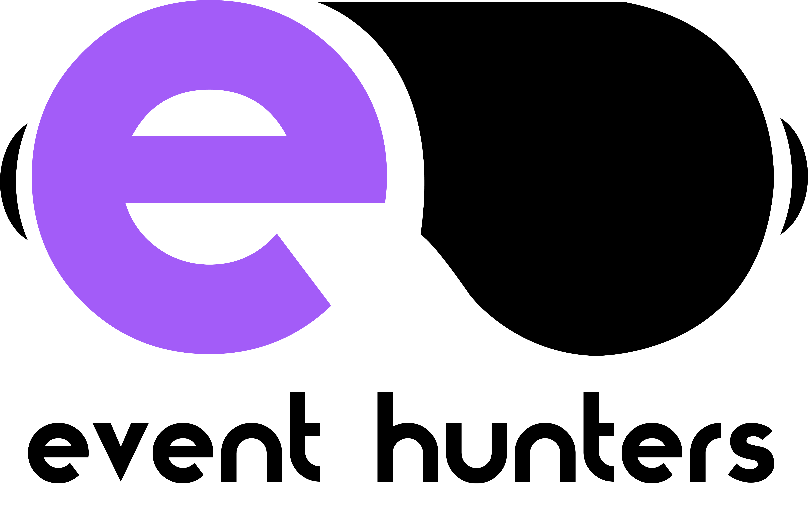

# App Gestión de Eventos - Proyecto Transversal DAW 1 Stucom 2024/2025 - Marc, Adrian y Mauro

  

---

## 📖 Introducción
**`Event Hunters`** es una aplicación web diseñada para descubrir, comparar y reservar eventos de experiencias inmersivas en Cataluña. Nuestro objetivo es ofrecer a los usuarios las mejores ofertas, reseñas transparentes y la posibilidad de crear grupos para disfrutar de aventuras únicas. Ideal para quienes buscan salir de su zona de confort y explorar nuevas actividades culturales, educativas o recreativas.

---

## 🚀 Características Principales
- **`Calendario Interactivo`**: Filtra eventos por fecha, ubicación y categoría.
- **`Reseñas y Ratings`**: Opiniones de usuarios para ayudarte a elegir la mejor experiencia.
- **`Accesibilidad Universal`**: Diseño adaptado para personas con discapacidades (daltonismo, epilepsia) y opciones de idioma.
- **`Diseño Responsive`**: Compatible con dispositivos móviles, tablets y PC.
- **`Gestión de Grupos`**: Crea grupos con amigos o únete a otros usuarios.
- **`Suscripciones Personalizadas`**: Recibe notificaciones de eventos según tus intereses.
- **`Mapas Interactivos`**: Ubicación precisa de cada evento.
- **`Herramientas SEO y Analytics`**: Optimización para motores de búsqueda y análisis de tráfico.

---

## 🛠️ Tecnologías Utilizadas
- **`Frontend`**: HTML5, CSS3, JavaScript.
- **`Backend`**: PHP.
- **`Base de Datos`**: MySQL.
- **`Diseño`**: Figma (Wireframes), draw.io (Diagramas de flujo).
- **`Herramientas`**: Google Analytics, Visual Studio Code.

---

## 📌 Perfiles

  <a href="https://github.com/morenomp" style="display:inline-block; margin: 0 20px;">
     
    <b>@morenomp</b>
  </a>

  <a href="https://github.com/mauroserralvodev" style="display:inline-block; margin: 0 20px;">
     
    <b>@mauroserralvodev</b>
  </a>

  <a href="https://github.com/AdrianPalmadev" style="display:inline-block; margin: 0 20px;">
     
    <b>@AdrianPalmadev</b>
  </a>

